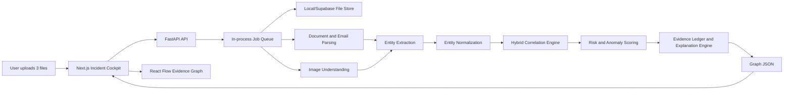
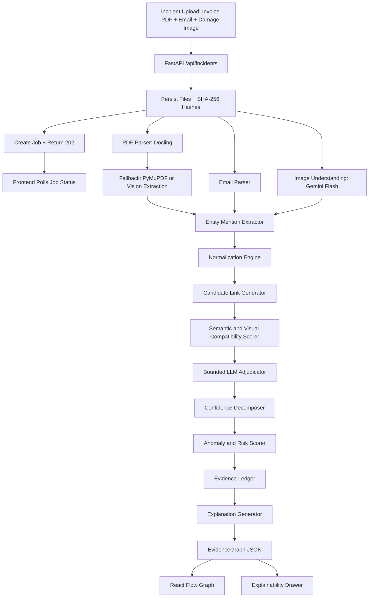

# OpsPilot AI - Principal Architecture Review and Hackathon Technical Plan

Prepared from the provided documents:

- `Docs/Opspilot Ai Complete Prd And Ppt Content.docx`
- `Docs/Startup Idea_ OpsPilot AI Analysis.docx`
- `Docs/Hackathon Blueprint_ OpsPilot AI Execution.pdf`

Role assumption: Chief Architect of OpsPilot AI. This is not a product plan, management plan, or implementation ticket list. It is a technical design review optimized for a 48-hour hackathon with 4 people, limited compute, free-tier services, highly technical judges, and high demo reliability requirements.

## Executive Position

The documents contain a strong core idea, but they repeatedly confuse an enterprise platform roadmap with a hackathon-winning technical artifact. The strongest version of OpsPilot AI is not a broad AIOps product, not a generic dashboard, and not a chatbot over uploaded files. It is a constrained multimodal evidence correlation engine that converts three operational artifacts into an auditable evidence graph.

The system wins if judges believe three things:

1. It extracted real structure from messy documents and images.
2. It linked evidence using controlled, inspectable logic rather than pure hallucination.
3. It produced an explainability trail that an operations, insurance, logistics, or compliance team could audit.

Everything else is optional, simulated, or removed.

## Input Document Analysis

### What Is Genuinely Valuable

The documents correctly identify a real technical and operational gap: evidence needed to resolve an incident is scattered across PDFs, images, emails, reports, logs, and spreadsheets. In logistics and claims workflows, this fragmentation is expensive because the relationship between financial records, customer complaints, and physical evidence is often implicit.

The strongest ideas are:

| Idea | Why it matters |
| --- | --- |
| Explainable cross-modal operational reasoning | This is the actual innovation. The system must connect evidence across modalities and explain why the connection exists. |
| Three-file hero flow | Invoice PDF + complaint email + damage image is concrete, judge-friendly, and technically rich. |
| Evidence graph visualization | A graph makes correlation visible and lets judges understand the system without reading logs. |
| Layout-aware parsing | Invoice tables and shipping metadata lose meaning if layout is destroyed. |
| Deterministic audit trail | Enterprises cannot trust model prose unless it is backed by source references, hashes, extracted entities, and confidence components. |
| Async backend | Multimodal parsing and model calls are too slow for synchronous request/response UX. |
| Ruthless MVP reduction | The PDF blueprint correctly recognizes that auth, Slack, Gmail, predictive analytics, and broad dashboards are distractions. |

### What Is Overengineered

The PRD tries to be a full enterprise SaaS platform. That is dangerous in a hackathon.

Overengineered parts:

| Item | Problem |
| --- | --- |
| Full operational dashboard | Looks standard and consumes UI time without proving intelligence. |
| User authentication, RBAC, profiles | Zero demo value. Adds failure modes. |
| Slack/Gmail/webhook integrations | External APIs, OAuth, rate limits, and live network risk. Not needed to prove the core. |
| Predictive analytics | Requires historical datasets and model validation. Not credible in 48 hours. |
| BigQuery/GCP platform layer | Too heavy for the prototype. Adds cloud setup burden. |
| Multiple databases listed together | Firebase, Firestore, PostgreSQL, Cloud Storage, FAISS, ChromaDB, Qdrant, Supabase are not a coherent architecture. |
| Large-scale vector database | Judges cannot see scale. A small candidate store is enough. |
| Multi-user enterprise workflow automation | Good future roadmap, bad hackathon scope. |
| Generic AIOps positioning | Competes with mature platforms and distracts from file-based operational evidence correlation. |

### What Is Unrealistic

The documents sometimes use technically impressive language in ways that overstate what can be built or proven.

Unrealistic assumptions:

| Claim or Direction | Reality |
| --- | --- |
| Traditional OCR plus embeddings is enough | Tesseract/EasyOCR will break invoice tables and scanned layouts. Downstream retrieval will inherit bad structure. |
| ColPali should be deployed in the hackathon | ColPali-style late-interaction document retrieval is technically strong but GPU-heavy, integration-heavy, and unnecessary for three files. |
| SHAP/LIME over a multimodal LLM pipeline | Real SHAP/LIME is not trivial for multimodal generative outputs. Use deterministic contribution scoring instead. |
| The system can mathematically prove causality | It can produce evidence-backed correlation, not proof. Avoid claiming proof. |
| Qdrant with one million vectors matters | The demo needs 3 uploaded files and maybe 10 seeded records. Scale is invisible. |
| FastAPI BackgroundTasks is production-grade job handling | Fine for MVP, but not durable. If the process dies, work is lost. Use a tiny persisted job store if possible. |
| Hugging Face Spaces will always be reliable | Free CPU containers can cold start, fail builds, or lack memory. Local fallback is mandatory. |
| LLM-generated explanations are explainability | They are only acceptable if grounded in an explicit evidence ledger. |
| 90 percent confidence threshold solves hallucination | Thresholds help only if the score is grounded in measurable features. Model self-confidence alone is not meaningful. |

### What Is Unnecessary

Remove these from the hackathon architecture:

- Authentication and RBAC.
- Organization/team management.
- Slack, Gmail, webhook, CRM, ERP integrations.
- Historical incident search.
- Full vector database scale story.
- Predictive analytics.
- Custom AI agents.
- Workflow automation.
- Multi-tenant SaaS administration.
- BigQuery.
- Complex process mining.
- Training custom models.
- Local ColPali deployment.
- Fully general support for every file type.

### What Should Be Replaced

| Existing Document Choice | Replace With | Reason |
| --- | --- | --- |
| Tesseract/EasyOCR as primary OCR | Docling for PDFs, PyMuPDF fallback, Gemini Vision for scanned pages/images | Preserves structure better and reduces OCR tuning. |
| Generic vector retrieval as core correlation | Hybrid deterministic candidate generation + semantic verification + constrained LLM adjudication | Prevents hallucinated links and creates auditable decisions. |
| LLM chain-of-thought explanation | Evidence ledger + confidence components + generated user-facing rationale | Real auditability comes from source tracing, not model prose. |
| Full dashboard | Single incident cockpit with graph and explainability drawer | Concentrates judge attention. |
| Broad AIOps platform | File-based operational evidence correlation engine | More precise, more defensible, easier to demo. |
| Cloud-first architecture | Local-first with cloud-compatible interfaces | Demo reliability beats theoretical deployment elegance. |
| Qdrant as must-build | Optional Qdrant; default in-memory or SQLite vector store | Avoids network/debug overhead. |
| SHAP/LIME MVP | Weighted contribution scoring with visible feature factors | Achievable and inspectable. |

### What Should Become The Core Innovation

The core innovation should be a provenance-first multimodal evidence graph.

This means OpsPilot AI does not merely say: "these files are related." It produces a graph where every edge has:

- the exact source documents that support it,
- extracted entity mentions,
- normalized canonical entities,
- deterministic matching features,
- semantic or visual compatibility evidence,
- confidence components,
- model version and prompt version,
- input hashes,
- a human-readable explanation generated only from the evidence ledger.

The graph is the product. The explanation panel is the trust layer. The LLM is a component, not the system.

## Section 1 - Core Technical Thesis

### One-Sentence Definition

OpsPilot AI is a provenance-first multimodal evidence correlation engine that converts fragmented operational artifacts into an auditable incident graph.

### What Technical Problem It Solves

Operational incidents often require linking evidence across incompatible representations:

- A PDF invoice contains structured financial and shipping data.
- A customer complaint email contains unstructured natural language.
- A damage image contains visual evidence with little or no text.

The technical problem is not summarization. The problem is entity grounding and cross-modal linkage under uncertainty.

The system must answer:

- Which invoice does this complaint refer to?
- Which shipment is pictured in this damage image?
- Does the visual damage support the complaint?
- Is there an inconsistency between invoice, complaint, and image?
- What evidence supports each edge in the graph?
- How confident is the system, and why?

### Why Current Systems Fail

Current systems fail for four reasons:

1. They require pre-integrated enterprise data.
   AIOps and process intelligence platforms often assume clean CMDBs, event logs, ERP integrations, or predefined ontologies. Real operational evidence lives in messy files and inboxes.

2. They are mostly single-modal.
   OCR systems extract text. Vision systems classify images. Email triage systems summarize messages. Few systems reliably fuse document layout, unstructured complaint language, and visual damage evidence into one decision.

3. They use opaque model outputs.
   A fluent explanation is not an audit trail. If a model cannot show source spans, hashes, extracted entities, and confidence factors, enterprises cannot trust it.

4. They over-index on retrieval.
   Vector similarity finds related text. It does not establish that an image belongs to an invoice or that a complaint maps to a shipment. Correlation needs structured entities, normalized identifiers, and gated reasoning.

### Why This Architecture Is Different

This architecture treats correlation as a graph construction problem, not a chat completion problem.

The pipeline is:

1. Extract modality-specific observations.
2. Convert observations into typed entity mentions.
3. Normalize mentions into canonical entities.
4. Generate candidate links using deterministic evidence.
5. Use semantic and visual reasoning only to support or reject candidates.
6. Construct graph edges with confidence components.
7. Generate explanations from the edge evidence ledger.

The important inversion: the LLM does not invent the graph. The backend constructs the candidate graph and asks the model to classify, enrich, or adjudicate bounded claims.

### True Technical Moat

The moat is not the UI, not the model provider, and not the vector database.

The technical moat is the evidence contract:

- typed multimodal entity extraction,
- canonical entity normalization,
- candidate link generation,
- confidence decomposition,
- source-level provenance,
- graph-native explainability.

This is the difference between "AI says these are related" and "the system can show why this invoice, complaint, and image form one incident."

## Section 2 - Architectural Redesign

### Design Constraints

Hard constraints:

- 48 hours.
- 4-person team.
- Free-tier or local services.
- Limited compute.
- Highly technical judges.
- Demo reliability is more important than theoretical scale.
- No training custom models.
- No broad enterprise integration.
- No external API dependency that is not essential to the hero path.

### Final Architectural Shape

Use a local-first, schema-first, async architecture:



### Frontend

#### Framework

Recommended: Next.js App Router + TypeScript.

Why chosen:

- Fast setup.
- Strong developer familiarity.
- Easy Vercel deployment if needed.
- Can serve a polished single-page app quickly.
- Supports route handlers/server actions, though this app should still call FastAPI for AI processing.

Alternatives rejected:

| Alternative | Why rejected |
| --- | --- |
| Raw React + Vite | Faster locally, but Next.js gives stronger deployment defaults and app structure. Acceptable fallback if team prefers speed. |
| Vue/Nuxt | No advantage unless team already knows it. |
| SvelteKit | Elegant, but fewer team members may know it. |
| Pure HTML/JS | Not enough structure for React Flow and stateful graph UI. |

Implementation difficulty: Moderate.

Hackathon risk: Low if the team already knows React.

#### Graph Engine

Recommended: `@xyflow/react` (React Flow) + Dagre layout.

Why chosen:

- Custom nodes and edges are easy.
- Pan/zoom/selection are built in.
- JSON mapping is straightforward.
- Judges immediately understand the visual output.
- Dagre is simpler than ELK and sufficient for a 10-20 node graph.

Alternatives rejected:

| Alternative | Why rejected |
| --- | --- |
| D3 from scratch | Too slow and bug-prone in 48 hours. |
| Canvas/WebGL graph | Overkill and harder for rich node UIs. |
| Cytoscape.js | Powerful, but React Flow gives better UI component composition. |
| ELK layout | Better for complex graphs, but integration is heavier than Dagre. |

Implementation difficulty: Moderate.

Hackathon risk: Medium. React Flow layout bugs can eat time. Use fixed mock graph early.

#### UI Architecture

Recommended UI surfaces:

- Single incident upload cockpit.
- Processing timeline with real job states.
- Evidence graph canvas.
- Right-side explainability drawer.
- Bottom or side entity table for extracted evidence.
- Minimal header with run status and confidence.

Do not build:

- Multi-page dashboard.
- User settings.
- Authentication flows.
- Admin panels.
- Generic analytics widgets.

Component architecture:

```text
app/
  page.tsx                         Single incident cockpit
components/
  upload/IncidentDropzone.tsx
  jobs/ProcessingTimeline.tsx
  graph/EvidenceGraph.tsx
  graph/nodes/DocumentNode.tsx
  graph/nodes/EntityNode.tsx
  graph/nodes/AnomalyNode.tsx
  graph/edges/ConfidenceEdge.tsx
  explainability/ExplainabilityDrawer.tsx
  evidence/EvidenceTable.tsx
lib/
  api.ts
  graphMapper.ts
  types.ts
```

#### State Management

Recommended:

- TanStack Query for server state and polling job status.
- Zustand or a small reducer for local UI state: selected node, selected edge, drawer open state, graph filters.
- React Flow internal state for nodes/edges after mapping.

Why chosen:

- Keeps async job state separate from graph UI state.
- Polling is simple and reliable.
- Avoids Redux overhead.

Alternatives rejected:

| Alternative | Why rejected |
| --- | --- |
| Redux Toolkit | Too much ceremony. |
| All state in React context | Can become tangled once graph selection and polling combine. |
| Server actions only | Long-running AI jobs still need polling and FastAPI. |

Implementation difficulty: Low to moderate.

Hackathon risk: Low.

#### Rendering Strategy

The frontend should never compute business logic. It should render backend graph JSON.

Rendering rules:

- Backend returns canonical `EvidenceGraph`.
- Frontend maps nodes to React Flow nodes.
- Frontend maps confidence to edge thickness/color.
- Frontend clusters by modality and entity type.
- Frontend initially shows top evidence only.
- Expansion is local UI filtering, not a new AI call.

Hackathon-safe graph limits:

- Initial graph: 6-10 nodes.
- Max visible graph: 20 nodes.
- Max initial edges: 10.
- Hide low-confidence edges by default.
- Provide "Show supporting evidence" expansion.

### Backend

#### Framework

Recommended: FastAPI + Pydantic.

Why chosen:

- Python AI ecosystem.
- Fast file upload endpoints.
- Pydantic schemas for strict model output validation.
- Easy local server.
- Easy deployment to Hugging Face Spaces, Render, Fly.io, or Railway if needed.

Alternatives rejected:

| Alternative | Why rejected |
| --- | --- |
| Express/Node | We need Python parsing/model libraries. |
| Django | Too heavy for this narrow API. |
| Flask | Fine, but weaker type/schema ergonomics than FastAPI. |
| Serverless-only backend | Long-running parsing/model calls risk timeouts. |

Implementation difficulty: Low to moderate.

Hackathon risk: Low locally; medium on free cloud.

#### API Design

Keep API small and job-oriented.

Endpoints:

```http
POST /api/incidents
Content-Type: multipart/form-data
Input: invoice_pdf, complaint_email, damage_image
Output: { "job_id": "job_...", "incident_id": "inc_...", "status": "queued" }

GET /api/jobs/{job_id}
Output: job status, current stage, progress events, error if any

GET /api/incidents/{incident_id}/graph
Output: EvidenceGraph JSON when ready

GET /api/incidents/{incident_id}/audit
Output: Evidence ledger, model calls, entity lineage, decision lineage

GET /health
Output: service health
```

Avoid streaming in the MVP unless the team is already comfortable with Server-Sent Events. Polling every 1-2 seconds is enough.

#### Async Architecture

Recommended MVP:

- `POST /api/incidents` validates files, stores them, creates a job row, returns `202`.
- A background worker runs in-process using `asyncio.create_task` or `ThreadPoolExecutor`.
- Job status is persisted to SQLite every stage.
- Frontend polls status.

Why not only `BackgroundTasks`:

- FastAPI `BackgroundTasks` is easy but not durable.
- If the server crashes, the job disappears.
- For a demo, this may be acceptable, but a tiny SQLite job table improves reliability with little cost.

Recommended job stages:

```text
queued
files_stored
invoice_parsed
email_parsed
image_analyzed
entities_extracted
entities_normalized
links_scored
risk_scored
graph_generated
completed
failed
```

#### Job Handling

MVP job store schema:

```sql
CREATE TABLE jobs (
  id TEXT PRIMARY KEY,
  incident_id TEXT NOT NULL,
  status TEXT NOT NULL,
  stage TEXT NOT NULL,
  progress INTEGER NOT NULL DEFAULT 0,
  error TEXT,
  created_at TEXT NOT NULL,
  updated_at TEXT NOT NULL
);

CREATE TABLE job_events (
  id TEXT PRIMARY KEY,
  job_id TEXT NOT NULL,
  stage TEXT NOT NULL,
  message TEXT NOT NULL,
  payload_json TEXT,
  created_at TEXT NOT NULL
);
```

Implementation difficulty: Low.

Hackathon risk: Low.

### Storage

#### Files

Recommended MVP: local content-addressed storage.

```text
data/
  uploads/
    sha256_prefix/
      original_filename
  incidents/
    inc_001/
      raw/
      parsed/
      graph.json
      audit.json
```

Every uploaded file gets:

- SHA-256 hash.
- MIME type.
- byte size.
- original filename.
- storage path.
- page count or image dimensions when available.

Why chosen:

- Local demo reliability.
- No bucket permissions.
- Easy source tracing.
- Can be replaced by Supabase Storage later.

Alternative: Supabase Storage.

Use Supabase only if the team already has it configured early. Do not let cloud storage block the hero flow.

#### Metadata

Recommended MVP: SQLite + SQLModel or SQLAlchemy Core.

Why chosen:

- Zero setup.
- Durable enough.
- Easy to inspect.
- Avoids cloud latency.

Alternative: Supabase Postgres.

Use Supabase only if deployed demo requires cloud persistence. It is optional.

#### Graph Data

Recommended: store graph JSON as immutable artifact per incident.

```text
incidents/{incident_id}/graph.v1.json
incidents/{incident_id}/audit.v1.json
```

Why chosen:

- Frontend can load one artifact.
- Demo replay is easy.
- If AI fails live, cached graph for same file hashes can be returned.

#### Vector Data

Recommended MVP: no external vector DB in critical path.

Use one of:

1. In-memory cosine search over a tiny list of embeddings.
2. SQLite table with embedding arrays serialized as JSON.
3. Optional Qdrant if already configured and stable.

Why:

- Three-file correlation does not require managed vector infra.
- Qdrant is useful for future scale but not visible in the demo.
- The correlation engine should use deterministic entities first.

Hackathon risk of external vector DB: Medium. Remove from critical path.

### AI Layer

#### Parsing

Recommended:

- PDF invoices: Docling primary, PyMuPDF fallback.
- Email: Python `email` module for `.eml`, plain text fallback.
- Image: Gemini Flash vision call or equivalent multimodal model.

Why chosen:

- Docling preserves tables better than Tesseract-style OCR.
- PyMuPDF is easy fallback for digitally generated PDFs.
- Gemini vision avoids local GPU dependencies.

Alternatives rejected:

| Alternative | Why rejected |
| --- | --- |
| Tesseract/EasyOCR primary | Brittle, layout-destructive, tuning-heavy. |
| LlamaParse primary | Good quality, but external cost/rate/key risk. |
| ColPali local | Too much compute and integration risk. |
| Full custom OCR pipeline | Not feasible in 48 hours. |

#### Entity Extraction

Use a two-pass extractor:

1. Deterministic extraction:
   - regex for invoice IDs, shipment IDs, tracking numbers, dates, amounts, currencies, email addresses, phone numbers, order IDs,
   - table field extraction from Docling markdown,
   - filename hints.

2. LLM structured extraction:
   - ask model to fill a strict JSON schema,
   - require source quotes/spans,
   - reject entities without source evidence,
   - validate with Pydantic.

Do not rely on spaCy/DistilBERT as the main extractor. Generic NER is weak for operational identifiers. Regex + schema-guided LLM extraction is faster and more accurate for the demo.

#### Multimodal Reasoning

Use the LLM for bounded visual and semantic judgments:

- classify visible damage,
- extract visible labels if readable,
- compare complaint text against visual damage labels,
- generate concise explanation text from evidence ledger.

Do not ask the LLM: "Are these files related?" without constraints.

Ask instead:

- "Given candidate shipment ID SHP-10488 extracted from invoice and email, does the image contain any visible evidence that supports the complaint description? Return JSON only."

#### Correlation

The correlation engine must be hybrid:

- deterministic candidate generation,
- semantic compatibility scoring,
- visual-text compatibility scoring,
- model adjudication only for bounded claims,
- confidence decomposition.

#### Explainability Layer

The explainability layer is not a paragraph generator. It is an audit system with generated language on top.

Core structures:

- evidence references,
- entity lineage,
- decision lineage,
- confidence components,
- model call records,
- source hashes,
- final explanation claims.

Implementation difficulty: Moderate.

Hackathon risk: Medium. Keep schemas tight.

## Section 3 - Multimodal Reasoning Engine

This section defines the exact pipeline from Invoice PDF + Customer Complaint Email + Damage Image to graph.

### Data Structures Used Throughout

#### DocumentArtifact

```json
{
  "id": "doc_invoice_001",
  "incident_id": "inc_001",
  "type": "invoice_pdf",
  "filename": "invoice_87421.pdf",
  "mime_type": "application/pdf",
  "sha256": "b7d3...",
  "storage_uri": "data/uploads/b7/d3/invoice_87421.pdf",
  "created_at": "2026-05-29T10:00:00Z",
  "metadata": {
    "page_count": 2,
    "parser": "docling",
    "parser_version": "recorded_at_runtime"
  }
}
```

#### SourceRef

```json
{
  "id": "src_invoice_total_001",
  "document_id": "doc_invoice_001",
  "kind": "text_span",
  "page": 1,
  "text": "Shipment ID: SHP-10488",
  "char_start": 230,
  "char_end": 252,
  "bbox": [72, 144, 220, 160],
  "hash": "sha256_of_source_fragment"
}
```

#### EntityMention

```json
{
  "id": "mention_shipment_invoice_001",
  "document_id": "doc_invoice_001",
  "source_ref_id": "src_invoice_total_001",
  "entity_type": "shipment_id",
  "raw_value": "Shipment ID: SHP-10488",
  "normalized_value": "SHP10488",
  "extraction_method": "regex",
  "confidence": 0.99
}
```

#### CanonicalEntity

```json
{
  "id": "ent_shipment_SHP10488",
  "entity_type": "shipment",
  "canonical_value": "SHP10488",
  "mentions": [
    "mention_shipment_invoice_001",
    "mention_shipment_email_001"
  ],
  "confidence": 0.98
}
```

#### EvidenceClaim

```json
{
  "id": "claim_damage_match_001",
  "claim_type": "visual_text_support",
  "subject_entity_id": "ent_shipment_SHP10488",
  "statement": "The complaint describes crushed corner damage and the image classifier detected crushed corner damage on the pallet.",
  "supporting_source_refs": [
    "src_email_damage_001",
    "src_image_damage_001"
  ],
  "confidence_components": {
    "deterministic": 0.0,
    "semantic": 0.86,
    "vision_text": 0.91,
    "model_adjudication": 0.88
  },
  "final_confidence": 0.88
}
```

### Step 1 - Data Extraction

#### Input

- Invoice PDF.
- Customer complaint email (`.eml` or `.txt`).
- Damage image (`.jpg`, `.png`, `.webp`).

#### Output

- Parsed invoice markdown and table blocks.
- Parsed email body, headers, attachments if any.
- Image observations.
- Document artifacts and source refs.

#### Algorithms and Models

Invoice:

- Primary: Docling PDF conversion to structured markdown.
- Fallback: PyMuPDF text extraction.
- Optional fallback: render page image and ask Gemini Vision to extract key fields only.

Email:

- Python MIME parser.
- Strip quoted replies when possible.
- Preserve subject, from, to, timestamp.

Image:

- Gemini Flash vision prompt with strict JSON response.
- Request visible labels, damage type, severity, package condition, any readable identifiers.

#### Example Image Analysis Output

```json
{
  "document_id": "doc_image_001",
  "observations": [
    {
      "id": "obs_damage_001",
      "type": "damage_classification",
      "label": "crushed_corner",
      "severity": "moderate",
      "confidence": 0.91,
      "source_ref_id": "src_image_damage_001"
    },
    {
      "id": "obs_label_001",
      "type": "visible_text",
      "label": "SHP-10488",
      "confidence": 0.62,
      "source_ref_id": "src_image_label_001"
    }
  ]
}
```

### Step 2 - Entity Extraction

#### Input

- Parsed invoice markdown.
- Parsed email text.
- Image observations.

#### Output

- Entity mentions with source references.

#### Entity Types

```text
invoice_id
shipment_id
tracking_id
order_id
customer_name
carrier_name
origin_address
destination_address
invoice_date
delivery_date
amount
currency
damage_type
urgency_signal
complaint_reference
```

#### Algorithms

Deterministic extractors:

- regex for IDs and dates,
- currency/amount parser,
- table row parser,
- label-value parser,
- filename parser.

LLM extractor:

- structured output JSON,
- source quote required,
- reject entries with no source quote,
- Pydantic validation.

#### Model Use

Primary: Gemini Flash for structured extraction when regex is insufficient.

Fallback: deterministic extraction only for golden path.

Open-source optional: `sentence-transformers` for semantic descriptions, not core IDs.

### Step 3 - Entity Normalization

#### Input

- Entity mentions.

#### Output

- Canonical entities.
- Normalization map.

#### Algorithms

Normalization rules:

- Uppercase IDs.
- Remove separators for IDs: `SHP-10488`, `SHP 10488`, `shp10488` all normalize to `SHP10488`.
- ISO-8601 dates.
- Decimal currency amounts.
- Damage taxonomy normalization.
- Fuzzy match customer names only if similarity is high and there is supporting address/order evidence.

Damage taxonomy:

```json
{
  "crushed_corner": ["crushed corner", "corner crushed", "box corner caved", "corner damage"],
  "water_damage": ["wet", "water stain", "soaked", "moisture damage"],
  "torn_packaging": ["torn", "ripped", "punctured", "packaging breach"],
  "missing_item": ["shortage", "missing", "not received", "partial delivery"]
}
```

Do not normalize weak customer names aggressively. False merges are worse than missed links.

### Step 4 - Cross-Modal Linking

#### Input

- Canonical entities.
- Source refs.
- Image observations.
- Parsed documents.

#### Output

- Candidate links and scored graph edges.

#### Algorithms

Use three stages:

1. Candidate generation:
   - exact shipment/tracking/invoice ID match,
   - date proximity,
   - customer/carrier/address similarity,
   - image visible text match if present.

2. Compatibility scoring:
   - semantic similarity between complaint description and image damage labels,
   - contradiction checks between invoice status and complaint,
   - amount/date mismatch checks.

3. Bounded LLM adjudication:
   - only for generated candidates,
   - prompt includes extracted evidence and asks for JSON classification: `supports`, `contradicts`, `insufficient_evidence`,
   - no unsupported IDs accepted.

#### Confidence Formula

For a document-to-document correlation edge:

```text
final_confidence =
  0.40 * identifier_score +
  0.15 * party_score +
  0.10 * temporal_score +
  0.20 * semantic_damage_score +
  0.10 * vision_text_score +
  0.05 * model_adjudication_score
```

The weights are intentionally deterministic and visible. They can be tuned for the demo, but the explanation panel must show them.

Thresholds:

```text
>= 0.85: confirmed edge
0.65 to 0.84: probable edge, shown with warning
0.45 to 0.64: weak edge, hidden by default
< 0.45: no edge
```

### Step 5 - Anomaly Detection

#### Input

- Canonical entities.
- Correlation edges.
- Extracted invoice values.
- Complaint urgency and damage observations.

#### Output

- Anomaly objects.

#### Algorithms

Rule-based MVP anomaly detection:

| Rule | Trigger |
| --- | --- |
| Damage complaint supported by image | complaint damage type matches image damage type. |
| Financial exposure | invoice amount exceeds threshold. |
| Identity mismatch | complaint references shipment but invoice has different customer or destination. |
| Delivery date conflict | complaint claims late/damaged delivery and invoice/delivery date supports timeline. |
| Missing corroboration | complaint references image but no visual support found. |

Do not train anomaly models in 48 hours. Use transparent rules.

### Step 6 - Risk Scoring

#### Input

- Anomalies.
- Edge confidence.
- Invoice amount.
- Complaint urgency.
- Evidence completeness.

#### Output

- Risk score and risk label.

#### Formula

```text
risk_score = clamp(
  35 * evidence_strength +
  25 * damage_severity +
  20 * financial_exposure +
  10 * urgency +
  10 * inconsistency_penalty,
  0,
  100
)
```

Labels:

```text
0-39: low
40-69: medium
70-100: high
```

This is not statistically calibrated risk. It is an interpretable operational triage score. Say that explicitly if asked.

### Step 7 - Explainability Generation

#### Input

- Evidence claims.
- Source refs.
- Confidence components.
- Model call metadata.
- Risk score factors.

#### Output

- Audit trail.
- User-facing explanation.
- Edge-specific explanations.

#### Generation Rules

The LLM may produce polished language, but it cannot invent facts. It receives only the evidence ledger and must output:

- summary,
- top supporting evidence,
- uncertainty,
- recommended next action.

If evidence is missing, the explanation must say so.

Example:

```json
{
  "summary": "High-risk shipment dispute detected for SHP-10488.",
  "why": [
    "The shipment ID SHP-10488 appears in both the invoice and the complaint email.",
    "The complaint describes crushed corner damage.",
    "The image analysis detected crushed corner damage with 0.91 confidence.",
    "The invoice value is 18,420.00 USD, exceeding the high-exposure threshold."
  ],
  "uncertainty": [
    "The image label text was partially readable, so the image-to-shipment link relies mainly on the invoice/email shipment ID and visual-text damage match."
  ],
  "recommended_action": "Route to claims review and request carrier delivery scan if available."
}
```

### Step 8 - Graph Generation

#### Input

- Documents.
- Canonical entities.
- Edges.
- Anomalies.
- Risk score.
- Explanations.

#### Output

- `EvidenceGraph` JSON consumed by React Flow.

Graph generation rules:

- Document nodes are first-class.
- Entity nodes sit between documents.
- Anomaly nodes are generated from claims/rules.
- Risk node summarizes the incident.
- Every edge references evidence.
- Low-confidence edges are marked, not hidden from audit.

## Section 4 - Evidence Graph Engine

### Graph Design Principles

1. The graph is an evidence map, not a decoration.
2. Every edge must have provenance.
3. Visual confidence must match computed confidence.
4. The graph must be small by default.
5. Expansion should reveal support, not clutter.

### Node Schema

```json
{
  "$schema": "https://json-schema.org/draft/2020-12/schema",
  "$id": "https://opspilot.ai/schemas/evidence-node.schema.json",
  "title": "EvidenceNode",
  "type": "object",
  "required": ["id", "type", "label", "confidence", "source_ref_ids", "data"],
  "properties": {
    "id": { "type": "string" },
    "type": {
      "type": "string",
      "enum": ["document", "entity", "observation", "anomaly", "risk", "action"]
    },
    "subtype": { "type": "string" },
    "label": { "type": "string" },
    "description": { "type": "string" },
    "confidence": { "type": "number", "minimum": 0, "maximum": 1 },
    "severity": { "type": "string", "enum": ["none", "low", "medium", "high", "critical"] },
    "source_ref_ids": {
      "type": "array",
      "items": { "type": "string" }
    },
    "data": {
      "type": "object",
      "additionalProperties": true
    },
    "visual": {
      "type": "object",
      "properties": {
        "cluster": { "type": "string" },
        "rank": { "type": "integer" },
        "collapsed": { "type": "boolean" },
        "icon": { "type": "string" }
      }
    }
  }
}
```

### Edge Schema

```json
{
  "$schema": "https://json-schema.org/draft/2020-12/schema",
  "$id": "https://opspilot.ai/schemas/evidence-edge.schema.json",
  "title": "EvidenceEdge",
  "type": "object",
  "required": ["id", "source", "target", "type", "confidence", "evidence_ref_ids"],
  "properties": {
    "id": { "type": "string" },
    "source": { "type": "string" },
    "target": { "type": "string" },
    "type": {
      "type": "string",
      "enum": [
        "contains",
        "mentions",
        "same_as",
        "supports",
        "contradicts",
        "correlates_with",
        "causes_risk",
        "requires_review"
      ]
    },
    "label": { "type": "string" },
    "confidence": { "type": "number", "minimum": 0, "maximum": 1 },
    "status": {
      "type": "string",
      "enum": ["confirmed", "probable", "weak", "rejected"]
    },
    "evidence_ref_ids": {
      "type": "array",
      "items": { "type": "string" }
    },
    "confidence_breakdown": {
      "$ref": "https://opspilot.ai/schemas/confidence.schema.json"
    },
    "explanation_id": { "type": "string" },
    "metadata": {
      "type": "object",
      "additionalProperties": true
    }
  }
}
```

### Confidence Schema

```json
{
  "$schema": "https://json-schema.org/draft/2020-12/schema",
  "$id": "https://opspilot.ai/schemas/confidence.schema.json",
  "title": "ConfidenceBreakdown",
  "type": "object",
  "required": ["final", "threshold", "components"],
  "properties": {
    "final": { "type": "number", "minimum": 0, "maximum": 1 },
    "threshold": { "type": "number", "minimum": 0, "maximum": 1 },
    "decision": {
      "type": "string",
      "enum": ["accept", "warn", "hide", "reject"]
    },
    "components": {
      "type": "object",
      "properties": {
        "identifier_score": { "type": "number", "minimum": 0, "maximum": 1 },
        "party_score": { "type": "number", "minimum": 0, "maximum": 1 },
        "temporal_score": { "type": "number", "minimum": 0, "maximum": 1 },
        "semantic_damage_score": { "type": "number", "minimum": 0, "maximum": 1 },
        "vision_text_score": { "type": "number", "minimum": 0, "maximum": 1 },
        "model_adjudication_score": { "type": "number", "minimum": 0, "maximum": 1 }
      },
      "additionalProperties": false
    },
    "weights": {
      "type": "object",
      "additionalProperties": { "type": "number" }
    },
    "calibration_note": { "type": "string" }
  }
}
```

### Metadata Schema

```json
{
  "$schema": "https://json-schema.org/draft/2020-12/schema",
  "$id": "https://opspilot.ai/schemas/graph-metadata.schema.json",
  "title": "GraphMetadata",
  "type": "object",
  "required": ["incident_id", "graph_version", "created_at", "input_hash", "pipeline_versions"],
  "properties": {
    "incident_id": { "type": "string" },
    "job_id": { "type": "string" },
    "graph_version": { "type": "string" },
    "created_at": { "type": "string", "format": "date-time" },
    "input_hash": { "type": "string" },
    "pipeline_versions": {
      "type": "object",
      "properties": {
        "parser": { "type": "string" },
        "entity_extractor": { "type": "string" },
        "correlation_engine": { "type": "string" },
        "risk_engine": { "type": "string" },
        "explanation_engine": { "type": "string" }
      }
    },
    "model_calls": {
      "type": "array",
      "items": {
        "type": "object",
        "properties": {
          "id": { "type": "string" },
          "provider": { "type": "string" },
          "model": { "type": "string" },
          "purpose": { "type": "string" },
          "prompt_hash": { "type": "string" },
          "input_artifact_ids": { "type": "array", "items": { "type": "string" } },
          "created_at": { "type": "string" }
        }
      }
    }
  }
}
```

### EvidenceGraph Schema

```json
{
  "$schema": "https://json-schema.org/draft/2020-12/schema",
  "$id": "https://opspilot.ai/schemas/evidence-graph.schema.json",
  "title": "EvidenceGraph",
  "type": "object",
  "required": ["metadata", "nodes", "edges", "source_refs", "explanations"],
  "properties": {
    "metadata": { "$ref": "https://opspilot.ai/schemas/graph-metadata.schema.json" },
    "nodes": {
      "type": "array",
      "items": { "$ref": "https://opspilot.ai/schemas/evidence-node.schema.json" }
    },
    "edges": {
      "type": "array",
      "items": { "$ref": "https://opspilot.ai/schemas/evidence-edge.schema.json" }
    },
    "source_refs": {
      "type": "array",
      "items": { "type": "object", "additionalProperties": true }
    },
    "explanations": {
      "type": "array",
      "items": { "type": "object", "additionalProperties": true }
    }
  }
}
```

### Visual Hierarchy

The graph should visually communicate causality and evidence flow without claiming actual causality beyond evidence.

Recommended layout:

```text
Left column:      Uploaded artifacts
Middle-left:      Extracted entities
Middle-right:     Correlations and observations
Right column:     Anomaly and risk node
Drawer:           Explanation and audit trail
```

Initial visible nodes:

- Invoice PDF document node.
- Complaint email document node.
- Damage image document node.
- Shipment entity node.
- Damage observation node.
- Invoice amount node.
- Central anomaly node.
- Risk score node.

### Layout Strategy

Use deterministic layered layout:

- group documents by modality,
- entities by canonical type,
- observations next to the source modality,
- anomaly/risk to the right,
- use fixed initial positions from Dagre,
- allow manual drag after render.

Do not let the LLM decide positions.

### Clustering Strategy

Cluster by graph role:

- `documents`
- `identifiers`
- `visual_observations`
- `financial_exposure`
- `anomalies`
- `actions`

For scale:

- collapse low-value mentions under canonical entity nodes,
- show top 3 supporting evidence refs,
- hide weak edges by default,
- provide edge filters by confidence and type.

### Expansion Strategy

Click behavior:

- Click document node: show extracted source refs and parsed text snippets.
- Click entity node: show mentions across documents.
- Click edge: show confidence breakdown and supporting claims.
- Click anomaly node: open explanation drawer.
- Click risk node: show risk formula and factor contributions.

Expansion should not trigger new model calls in the MVP. It should reveal already computed data.

### Explainability Interaction

The explainability drawer should have tabs:

1. Summary.
2. Evidence.
3. Confidence.
4. Lineage.
5. Model calls.

This makes the system feel enterprise-grade without building a large dashboard.

### Backend Graph To React Flow Mapping

Backend `EvidenceNode` maps to React Flow `Node`:

```ts
type ReactFlowNode = {
  id: string;
  type: "documentNode" | "entityNode" | "observationNode" | "anomalyNode" | "riskNode";
  position: { x: number; y: number };
  data: {
    label: string;
    subtype: string;
    confidence: number;
    severity?: string;
    sourceRefIds: string[];
    raw: EvidenceNode;
  };
};
```

Backend `EvidenceEdge` maps to React Flow `Edge`:

```ts
type ReactFlowEdge = {
  id: string;
  source: string;
  target: string;
  type: "confidenceEdge";
  label: string;
  animated: boolean;
  data: {
    confidence: number;
    status: "confirmed" | "probable" | "weak" | "rejected";
    confidenceBreakdown: ConfidenceBreakdown;
    evidenceRefIds: string[];
    raw: EvidenceEdge;
  };
  style: {
    stroke: string;
    strokeWidth: number;
  };
};
```

Mapping rules:

```text
document -> documentNode
entity -> entityNode
observation -> observationNode
anomaly -> anomalyNode
risk -> riskNode
confidence >= 0.85 -> red or strong accent edge if anomaly, blue if support
0.65 <= confidence < 0.85 -> amber dashed edge
confidence < 0.65 -> hidden unless audit mode is active
```

## Section 5 - AI Model Selection

### Model Selection Principles

For a 48-hour hackathon:

- Optimize for reliability, not theoretical benchmark leadership.
- Minimize number of providers.
- Batch model calls.
- Cache every model response by input hash.
- Never put a paid or quota-uncertain model in the only critical path unless access is confirmed before the hackathon.
- Use deterministic code for identifiers and scoring.

### Task-by-Task Recommendation

| Task | Primary | Fallback | Why |
| --- | --- | --- | --- |
| PDF layout parsing | Docling | PyMuPDF + Gemini page-image extraction | Layout preservation matters. Avoid traditional OCR first. |
| Email parsing | Python email parser + regex | LLM structured extraction | Email is text; do not waste vision models. |
| Image understanding | Gemini Flash vision model | Claude vision or GPT-5 vision if available; precomputed fallback for demo | Need cheap multimodal image classification. |
| Entity extraction | Regex + Gemini Flash structured output | Regex-only golden path | Operational IDs are better handled deterministically. |
| Correlation adjudication | Hybrid engine + Gemini Flash bounded JSON | Gemini Pro/GPT-5/Claude for premium adjudication; deterministic-only fallback | Model should adjudicate candidates, not invent links. |
| Explanation language | Deterministic templates + Gemini Flash polish | Template-only | Explanation must come from evidence ledger. |
| Embeddings | Lightweight sentence-transformer or provider embedding | No embeddings; use lexical/deterministic matching | Embeddings are helpful but not core for three files. |

### Gemini Flash

Recommended role:

- Primary multimodal model for image understanding.
- Structured extraction assistant.
- Bounded correlation adjudicator.
- Explanation text generator from evidence ledger.

Why chosen:

- Multimodal support.
- Strong latency/cost profile.
- Generous free-tier availability per provided blueprint.
- Good enough for the golden path.

Rejected use:

- Do not ask Gemini to produce the whole graph from raw files in one uncontrolled prompt as the main design. That is fragile and judge-vulnerable.

Implementation difficulty: Low.

Hackathon risk: Low to medium depending on quota/network.

### Gemini Pro

Recommended role:

- Optional final adjudication for ambiguous cases.
- Optional higher-quality explanation generation.

Why not primary:

- Higher latency.
- More quota/cost risk.
- The demo does not need deep reasoning on many files.

Use when:

- Flash returns uncertain classification.
- Final explanation needs more polish.
- There is confirmed quota.

### GPT-5

Recommended role:

- Do not make GPT-5 the primary critical-path model unless API access, pricing, rate limits, and multimodal support are confirmed before the event.
- If available, use GPT-5 or a smaller GPT-5-tier model for final structured adjudication and explanation comparison.

Why not primary:

- Access uncertainty.
- Cost uncertainty.
- Rate-limit uncertainty.
- Vendor setup risk.

Where it may outperform:

- Complex reasoning over evidence ledgers.
- High-quality structured explanation.
- More reliable JSON under strict schemas, depending on available API.

Hackathon recommendation:

- Treat GPT-5 as a premium fallback, not the default.

### Claude

Recommended role:

- Explanation quality.
- Long context analysis of extracted evidence.
- Optional visual reasoning if the team has access to a Claude vision-capable model.

Why not primary:

- Free-tier access may be weaker or less predictable.
- Additional provider integration increases failure modes.

Where Claude is strong:

- Careful language.
- Conservative reasoning.
- User-facing explanation quality.

Hackathon recommendation:

- Use only if a teammate already has stable API access.

### Open-Source Alternatives

Useful open-source components:

| Component | Use | Risk |
| --- | --- | --- |
| Docling | PDF layout parsing | Dependency size and runtime memory. |
| PyMuPDF | PDF fallback | Loses structure on complex scanned PDFs. |
| sentence-transformers | Text embeddings | Download time and model size. |
| spaCy | Basic NER | Weak for domain-specific IDs. |
| CLIP/SigLIP | Image-text similarity | Local model download and weaker damage-specific reasoning. |
| LayoutLMv3 | Document understanding | Too heavy for 48h unless already packaged. |
| ColPali | OCR-free document retrieval | Strong research direction, bad hackathon default due compute/integration. |

### Cost Analysis

For the demo path, target model calls per incident:

1. Image analysis call.
2. Structured extraction/correlation call over parsed invoice + email + image observations.
3. Explanation polish call from evidence ledger.

That is 2-3 model calls per run. With caching, repeated demo runs should cost zero additional model calls for identical inputs.

Free-tier risk is manageable if:

- the team caches responses by file hash,
- the team avoids per-entity model calls,
- the team rehearses with cached artifacts,
- the live demo has a deterministic fallback graph.

Do not rotate keys to bypass rate limits. That is a bad engineering and platform-compliance habit. Use batching, caching, queueing, and fallback artifacts.

### Rate-Limit Analysis

Assuming a model quota similar to the blueprint's Gemini Flash claim of roughly 15 requests per minute and 1,500 requests per day:

- 3 calls per incident means about 5 full uncached runs per minute.
- In practice, latency will be the limiting factor.
- During development, uncontrolled testing can burn quota quickly.
- Cache all model calls from hour 8 onward.
- Add exponential backoff.
- Add a manual "Use cached demo result" switch.

Recommended model call policy:

```text
if exact input_hash exists:
    return cached graph
else:
    run model pipeline
    persist model responses and graph
```

## Section 6 - Document Understanding

### OCR

Traditional OCR includes Tesseract and EasyOCR.

Strengths:

- Free.
- Local.
- Works on simple scanned text.

Weaknesses:

- Destroys table structure.
- Needs preprocessing.
- Poor on rotated, low-resolution, or cluttered documents.
- Produces text without reliable layout semantics.

Recommendation:

- Do not use as primary.
- Use only as emergency fallback for simple images if Gemini is unavailable.

### Docling

Strengths:

- Preserves more document structure than raw OCR.
- Converts PDFs to useful markdown.
- Open-source.
- Good architectural story.

Weaknesses:

- Dependency/runtime risk.
- May be slow on free CPU.
- Container memory risk.

Recommendation:

- Use as primary PDF parser if installed quickly.
- Keep PyMuPDF fallback from the start.
- Do not spend more than 3-4 hours fighting Docling installation.

### LlamaParse

Strengths:

- High-quality parsing for complex documents.
- Good for tables/forms.
- Less local dependency pain.

Weaknesses:

- External API dependency.
- Cost/credits/rate risk.
- Another account/key setup.

Recommendation:

- Strong fallback if team already has access.
- Not primary unless setup is confirmed before development begins.

### ColPali

Strengths:

- Excellent OCR-free retrieval concept.
- Preserves visual layout via page-image embeddings.
- Strong research credibility.

Weaknesses:

- GPU and model integration risk.
- Overkill for three files.
- Hard to explain and debug under time pressure.

Recommendation:

- Mention as future architecture.
- Do not build in 48 hours.

### OCR-Free Retrieval

Strengths:

- Avoids text extraction errors.
- Useful at scale for document search.

Weaknesses:

- Not needed for the golden path.
- Requires embedding infrastructure.
- Harder to provide source-level text citations unless paired with extraction.

Recommendation:

- Not MVP.
- Future enhancement for large document repositories.

### Vision-Based Parsing

Strengths:

- Strong for scanned pages and images.
- Can understand layout visually.
- Useful when text extraction fails.

Weaknesses:

- Cost/rate dependency.
- May hallucinate fields unless constrained.
- Requires strict JSON and source quote validation.

Recommendation:

- Use Gemini Vision for image analysis and emergency PDF page extraction.
- Do not rely on it alone for invoice parsing if Docling can provide text/tables.

### Final Document Understanding Recommendation

Build a three-tier parser:

```text
Tier 1: Docling for PDF to markdown/tables.
Tier 2: PyMuPDF for digital PDF fallback.
Tier 3: Gemini Vision page extraction for scanned/failed pages.
```

This gives the strongest balance of quality, feasibility, and demo reliability.

## Section 7 - Correlation Engine

### The Core Question

How does the system know:

- the invoice belongs to the image,
- the image belongs to the complaint,
- the complaint belongs to the shipment,

without hallucinating?

Answer: it does not "know" from one model response. It builds evidence-backed candidate links and accepts only links that pass explicit gates.

### Deterministic Approach

Mechanism:

- Extract IDs, dates, customer names, carrier names, order numbers, invoice numbers.
- Normalize entities.
- Link documents when canonical IDs match.
- Use rule thresholds for dates/amounts/damage types.

Strengths:

- Auditable.
- Fast.
- Low cost.
- Low hallucination.

Weaknesses:

- Fails when IDs are missing.
- Cannot reliably interpret visual damage.
- Brittle with messy language.

Use cases:

- Invoice to email via shipment ID.
- Invoice to complaint via order ID.
- Financial exposure from invoice amount.

### Semantic Approach

Mechanism:

- Embed text chunks, descriptions, image captions, and damage labels.
- Compute similarity.
- Ask LLM for relationship classification.

Strengths:

- Handles vague complaints.
- Handles synonyms.
- Bridges image labels and text descriptions.

Weaknesses:

- Can produce plausible false positives.
- Harder to audit.
- Similarity is not identity.
- Needs confidence calibration.

Use cases:

- Complaint text "corner crushed and wet" to image observation "crushed corner, water staining".
- Complaint urgency to risk factor.

### Hybrid Approach

Mechanism:

1. Deterministic extraction creates candidate entities.
2. Candidate links are generated only from explicit evidence.
3. Semantic scoring supports ambiguous relationships.
4. LLM adjudication is bounded to candidate links.
5. Confidence score is decomposed.
6. Edges without provenance are rejected.

Strengths:

- Best balance of precision and flexibility.
- Strong explainability.
- Can handle missing visual IDs if complaint and invoice share shipment ID and image supports damage.

Weaknesses:

- More engineering than a single LLM prompt.
- Requires schemas and validation.

Recommendation: Build the hybrid approach.

### Concrete Link Logic

Invoice belongs to complaint if:

- shipment/tracking/order/invoice ID match is exact or high-confidence normalized match,
- or customer + date + amount/shipment route support the link,
- and no hard contradiction exists.

Image belongs to complaint if:

- visible ID in image matches complaint/invoice, or
- image damage taxonomy matches complaint damage taxonomy,
- and the complaint refers to physical damage or delivery condition.

Image belongs to invoice/shipment if:

- visible ID matches shipment/tracking/order ID, or
- image belongs indirectly through complaint already linked to invoice,
- and visual damage supports the same incident.

Complaint belongs to shipment if:

- complaint mentions shipment/tracking/order ID, or
- complaint mentions customer/date/carrier matching invoice fields with high confidence.

No link is accepted solely because an LLM says the files are related.

## Section 8 - Explainability Engine

### Definition Of Real Explainability

Real explainability means the system can show:

- what evidence was used,
- where it came from,
- how it was transformed,
- what decision was made,
- which scoring factors contributed,
- what uncertainty remains.

It does not mean exposing chain-of-thought. It does not mean asking the model to rationalize itself.

### Evidence Provenance

Every extracted fact must point to a source.

```json
{
  "source_ref_id": "src_email_damage_001",
  "document_id": "doc_email_001",
  "document_sha256": "a91c...",
  "location": {
    "kind": "email_body_span",
    "char_start": 141,
    "char_end": 196
  },
  "text": "The pallet arrived with the front-left corner crushed.",
  "extracted_as": ["damage_type:crushed_corner"],
  "extraction_method": "llm_structured_output",
  "confidence": 0.92
}
```

### Audit Trail Generation

Audit trail record:

```json
{
  "audit_id": "audit_inc_001_v1",
  "incident_id": "inc_001",
  "input_hash": "combined_sha256_of_all_inputs",
  "pipeline_version": "opspilot-pipeline-0.1.0",
  "steps": [
    {
      "step": "invoice_parsing",
      "tool": "docling",
      "input_document_id": "doc_invoice_001",
      "output_artifact_id": "parsed_invoice_001",
      "status": "success",
      "duration_ms": 1840
    },
    {
      "step": "entity_normalization",
      "tool": "ruleset:v1",
      "input_artifact_id": "mentions_001",
      "output_artifact_id": "entities_001",
      "status": "success",
      "duration_ms": 44
    }
  ]
}
```

### Confidence Scoring

Confidence is not one number from a model. It is a decomposed score.

Example edge confidence:

```json
{
  "edge_id": "edge_email_invoice_shipment",
  "final": 0.94,
  "decision": "accept",
  "threshold": 0.85,
  "components": {
    "identifier_score": 1.0,
    "party_score": 0.88,
    "temporal_score": 0.90,
    "semantic_damage_score": 0.84,
    "vision_text_score": 0.60,
    "model_adjudication_score": 0.89
  },
  "weights": {
    "identifier_score": 0.40,
    "party_score": 0.15,
    "temporal_score": 0.10,
    "semantic_damage_score": 0.20,
    "vision_text_score": 0.10,
    "model_adjudication_score": 0.05
  },
  "calibration_note": "MVP heuristic score. Not statistically calibrated. Intended for triage and explainability."
}
```

### Entity Lineage

```json
{
  "canonical_entity_id": "ent_shipment_SHP10488",
  "canonical_value": "SHP10488",
  "entity_type": "shipment",
  "lineage": [
    {
      "mention_id": "mention_invoice_shipment_001",
      "document_id": "doc_invoice_001",
      "raw_value": "SHP-10488",
      "normalization_rule": "uppercase_remove_non_alphanumeric",
      "source_ref_id": "src_invoice_shipment_001"
    },
    {
      "mention_id": "mention_email_shipment_001",
      "document_id": "doc_email_001",
      "raw_value": "Shipment shp 10488",
      "normalization_rule": "uppercase_remove_non_alphanumeric",
      "source_ref_id": "src_email_shipment_001"
    }
  ]
}
```

### Decision Lineage

```json
{
  "decision_id": "decision_high_risk_001",
  "decision_type": "risk_classification",
  "output": "high",
  "score": 86,
  "inputs": [
    "edge_email_invoice_shipment",
    "claim_damage_match_001",
    "entity_invoice_amount_18420_usd"
  ],
  "rules_fired": [
    {
      "rule_id": "RISK_DAMAGE_SUPPORTED_BY_IMAGE",
      "contribution": 25,
      "evidence_ref_ids": ["src_email_damage_001", "src_image_damage_001"]
    },
    {
      "rule_id": "RISK_HIGH_FINANCIAL_EXPOSURE",
      "contribution": 20,
      "evidence_ref_ids": ["src_invoice_amount_001"]
    }
  ]
}
```

### Source Tracing In UI

When a judge clicks an explanation claim, the UI should highlight:

- source document,
- source snippet,
- entity extracted,
- normalized value,
- graph edge using it.

Even if the highlight is implemented as a drawer row rather than a full PDF viewer, the structure must be visible.

### Example Output

```json
{
  "incident_summary": "High-risk shipment dispute detected for SHP-10488.",
  "risk_score": 86,
  "risk_label": "high",
  "primary_explanation": "The invoice and complaint are linked by the normalized shipment ID SHP10488. The complaint describes crushed corner damage, and the image analysis detected matching crushed corner damage. The invoice amount exceeds the high-exposure threshold, increasing operational risk.",
  "supporting_evidence": [
    {
      "claim": "Shipment ID appears in invoice and email.",
      "confidence": 0.99,
      "source_refs": ["src_invoice_shipment_001", "src_email_shipment_001"]
    },
    {
      "claim": "Image damage matches complaint damage description.",
      "confidence": 0.88,
      "source_refs": ["src_email_damage_001", "src_image_damage_001"]
    }
  ],
  "uncertainties": [
    "Image-to-shipment linkage is indirect because the visible label in the image is low confidence."
  ]
}
```

## Section 9 - Implementation Feasibility Review

Scores: 1 low, 5 high.

| Subsystem | Impact | Complexity | Effort | Demo Value | Classification | Reason |
| --- | ---: | ---: | ---: | ---: | --- | --- |
| Multimodal upload | 5 | 2 | 2 | 5 | Build | Required start of hero flow. |
| Job polling and progress timeline | 4 | 2 | 2 | 4 | Build | Turns latency into perceived sophistication. |
| Docling PDF parsing | 4 | 4 | 3 | 4 | Build with fallback | Valuable, but dependency risk. |
| PyMuPDF fallback | 3 | 1 | 1 | 2 | Build | Cheap reliability backup. |
| Email parsing | 4 | 1 | 1 | 3 | Build | Easy and required. |
| Gemini image analysis | 5 | 2 | 2 | 5 | Build | Core multimodal proof. |
| Regex entity extraction | 5 | 2 | 2 | 4 | Build | Hardens system against hallucination. |
| LLM structured extraction | 4 | 3 | 2 | 4 | Build | Useful if Pydantic-validated. |
| Entity normalization | 5 | 2 | 2 | 5 | Build | Core technical credibility. |
| Hybrid correlation engine | 5 | 4 | 4 | 5 | Build | The real system. Keep narrow. |
| Risk scoring | 4 | 2 | 2 | 4 | Build | Use transparent rules. |
| Evidence graph JSON | 5 | 3 | 3 | 5 | Build | Contract between backend and frontend. |
| React Flow graph | 5 | 3 | 3 | 5 | Build | Main visual moment. |
| Explainability drawer | 5 | 3 | 3 | 5 | Build | Trust differentiator. |
| Audit trail | 5 | 3 | 3 | 5 | Build simplified | Must show hashes, sources, confidence. |
| Qdrant | 2 | 3 | 3 | 1 | Simplify/remove | Optional. Not needed for 3 files. |
| Supabase | 2 | 2 | 2 | 1 | Simplify/remove | Use local first. |
| Auth/RBAC | 1 | 3 | 3 | 0 | Remove | No judge value. |
| Slack/Gmail integrations | 1 | 4 | 4 | 1 | Remove | High demo failure risk. |
| Predictive analytics | 2 | 5 | 5 | 1 | Remove | Not credible without data. |
| ColPali | 3 | 5 | 5 | 2 | Remove from MVP | Mention as future, do not build. |
| SHAP/LIME | 3 | 5 | 5 | 2 | Fake/simplify | Use contribution scoring instead. |
| Full dashboard metrics | 2 | 2 | 2 | 2 | Fake during demo | Static metrics are acceptable background. |
| Offline cached demo result | 5 | 1 | 1 | 5 | Build | Protects presentation. |

### Ruthless Build/Simplify/Remove/Fake Summary

Build:

- file upload,
- async job progress,
- parsing fallback chain,
- image analysis,
- entity extraction and normalization,
- hybrid correlation,
- graph JSON,
- React Flow graph,
- explainability drawer,
- cached demo fallback.

Simplify:

- vector search,
- storage,
- audit trail,
- risk scoring,
- layout parsing.

Remove:

- auth,
- Slack/Gmail,
- predictive analytics,
- full dashboard,
- multi-tenant SaaS,
- process mining,
- training custom models.

Fake during demo, if needed:

- large historical database,
- background dashboard stats,
- enterprise deployment scale,
- optional seeded records,
- graph animation timing,
- fallback graph for known input hash.

Must be real:

- upload path,
- at least one parser result,
- at least one model image analysis call or cached model response from exact input,
- actual entity normalization,
- actual confidence calculation,
- actual graph rendering from backend JSON.

## Section 10 - Hackathon Optimization

### Minimum Architecture That Still Looks Enterprise-Grade

Minimum credible architecture:

- Next.js single incident cockpit.
- FastAPI job API.
- Local file storage with hashes.
- Docling/PyMuPDF parser.
- Gemini Flash image/extraction call.
- Rule-based entity normalization.
- Hybrid edge scoring.
- React Flow graph.
- Explainability drawer with audit ledger.

This looks enterprise-grade because it has provenance, schema contracts, and graph explainability. It does not need enterprise infrastructure.

### Maximum Technical Depth Achievable In 48 Hours

Achievable depth:

- Typed evidence graph schema.
- Source-level provenance.
- Entity lineage.
- Confidence decomposition.
- Cross-modal visual-text match.
- Deterministic risk scoring.
- Cached model response replay.
- Progressive graph disclosure.

Not achievable:

- full ontology engine,
- production vector search,
- true calibrated risk model,
- custom model training,
- general document understanding across arbitrary PDFs,
- robust enterprise security,
- real-time integrations.

### Features Judges Will Remember

- The graph generating from three messy files.
- Clicking an edge and seeing exact evidence.
- Confidence breakdown that is not just a model score.
- The image damage matching the complaint text.
- The invoice amount increasing risk.
- The system admitting uncertainty when image label text is weak.

### Features Judges Will Ignore

- Auth screens.
- Generic dashboard cards.
- Number of seeded vector records.
- Whether storage is Supabase or local.
- Whether the app has organization management.
- Market sizing slides if the technical demo is weak.

### Features Likely To Break

- Docling install/runtime in cloud.
- Free-tier model rate limits.
- External vector DB connection.
- Hugging Face Spaces Docker build.
- React Flow layout with too many nodes.
- OCR on bad PDFs.
- Live Wi-Fi-dependent demo.

### Features That Should Be Simulated

- Large-scale vector database.
- Historical incident corpus.
- Background metrics.
- Enterprise integrations.
- Multi-user collaboration.
- Production deployment.

### Features That Must Be Real

- The backend must return graph JSON.
- The graph must render dynamically from JSON.
- Confidence must be computed from explicit fields.
- Explanation must show source refs.
- At least one AI model call should run during rehearsal, and live if network allows.
- Cached fallback must correspond to the exact demo inputs.

### 48-Hour Build Order

Hour 0-2:

- Freeze schema.
- Choose golden demo files.
- Create static graph JSON by hand.
- Frontend starts rendering static graph immediately.

Hour 2-6:

- Build upload endpoint.
- Build job store.
- Build frontend upload and polling.
- Build cached graph response path.

Hour 6-12:

- Implement PDF parsing fallback chain.
- Implement email parsing.
- Implement image analysis prompt.
- Store parsed artifacts.

Hour 12-20:

- Implement entity extraction.
- Implement normalization.
- Implement source refs.
- Validate on golden files.

Hour 20-28:

- Implement hybrid correlation.
- Implement confidence decomposition.
- Implement risk scoring.
- Generate graph JSON.

Hour 28-36:

- Connect frontend to real graph.
- Build explainability drawer.
- Polish graph layout.
- Add progressive disclosure.

Hour 36-42:

- Add caching by input hash.
- Add failure fallback.
- Add clean loading timeline.
- Rehearse offline and online paths.

Hour 42-48:

- Fix only demo-breaking bugs.
- Freeze dependencies.
- Record backup demo video.
- Rehearse technical explanation.

## Section 11 - Final Recommended System

### Final Architecture Diagram



### Final Technology Stack

Frontend:

- Next.js App Router.
- TypeScript.
- Tailwind CSS.
- shadcn/ui only for drawers, buttons, tabs, tables.
- React Flow.
- Dagre layout.
- TanStack Query.
- Zustand or reducer for graph UI state.

Backend:

- FastAPI.
- Pydantic.
- SQLite.
- Local file storage.
- `asyncio`/thread executor job runner.
- Python email parser.
- Docling.
- PyMuPDF fallback.

AI/ML:

- Gemini Flash primary multimodal model.
- Optional Gemini Pro/GPT-5/Claude for fallback adjudication if credentials are stable.
- Regex/rule extractors.
- Optional sentence-transformers for semantic similarity.

Deployment:

- Local-first for demo.
- Optional Vercel frontend.
- Optional Hugging Face Spaces backend only if stable by hour 24.
- Keep local backup running.

Storage:

- Local files + SQLite for MVP.
- Supabase optional, not critical path.
- Qdrant optional future enhancement.

### Final AI Stack

Primary AI stack:

```text
Docling -> structured PDF markdown/tables
Regex/rules -> operational IDs, amounts, dates
Gemini Flash -> image observations, structured extraction assist, bounded adjudication
Deterministic scorer -> edge confidence and risk
Template + Gemini polish -> explanation text from evidence ledger
```

Fallback AI stack:

```text
PyMuPDF -> simple PDF text
Regex-only extraction -> known golden files
Cached Gemini outputs -> exact input hash replay
Template-only explanations -> no model dependency
Precomputed graph JSON -> emergency demo mode
```

### Final Data Flow

```text
Upload files
-> hash and store files
-> create job
-> parse invoice/email/image
-> create source refs
-> extract entity mentions
-> normalize canonical entities
-> generate candidate links
-> score links
-> detect anomalies
-> score risk
-> create evidence ledger
-> generate explanation
-> create graph JSON
-> render graph and drawer
```

### Final Graph Flow

```text
DocumentArtifact
-> SourceRef
-> EntityMention
-> CanonicalEntity
-> EvidenceClaim
-> EvidenceEdge
-> AnomalyNode
-> RiskNode
-> React Flow Node/Edge
```

### Final Explainability Flow

```text
Source refs
-> entity lineage
-> edge confidence components
-> rules fired
-> decision lineage
-> audit trail
-> generated explanation from ledger
-> clickable UI evidence
```

### Final Demo Flow

1. Open the incident cockpit.
2. Upload invoice PDF, complaint email, damage image.
3. Show live progress stages:
   - hashing evidence,
   - parsing invoice layout,
   - extracting complaint entities,
   - analyzing damage image,
   - normalizing shipment identifiers,
   - scoring cross-modal links,
   - generating evidence graph.
4. Graph renders.
5. Click central anomaly edge.
6. Drawer shows:
   - matched shipment ID,
   - image damage classification,
   - complaint text span,
   - invoice amount,
   - confidence breakdown,
   - uncertainty.
7. Close with the technical thesis:
   - "OpsPilot AI does not ask a model to guess. It builds a provenance-backed evidence graph and uses AI only where multimodal interpretation is needed."

### Final Build Order By Role

#### Frontend Engineer

1. Build static graph from mock JSON.
2. Build upload UI.
3. Build polling timeline.
4. Build graph node types.
5. Build explainability drawer.
6. Connect real backend graph.
7. Polish animation and layout.

#### Backend Engineer

1. Build FastAPI upload endpoint.
2. Build local file store and hashes.
3. Build job table and polling endpoint.
4. Build parser interfaces.
5. Build graph response endpoint.
6. Add cache by input hash.
7. Add emergency precomputed fallback.

#### AI/ML Engineer

1. Write golden file parser outputs manually first.
2. Implement Docling/PyMuPDF parsing.
3. Implement image analysis prompt.
4. Implement regex entity extraction.
5. Implement LLM structured extraction.
6. Implement normalization.
7. Implement scoring and confidence breakdown.

#### Demo/Design Lead

1. Create golden incident files.
2. Define exact narrative.
3. Keep UI focused on graph and explanation.
4. Record backup video.
5. Rehearse technical Q&A.

## Critical Assumptions To Challenge

### Assumption 1: More Modalities Means Better Product

False for the hackathon. More modalities means more parsing failure. Three modalities are enough: PDF, email, image.

### Assumption 2: Vector Search Is The Intelligence

False. Vector search is a support mechanism. The intelligence is grounded entity linkage plus provenance.

### Assumption 3: LLM Explanation Equals Trust

False. Trust comes from source tracing and decision lineage. LLM language is presentation, not proof.

### Assumption 4: Cloud Deployment Makes It More Real

False if cloud makes the demo fail. A reliable local demo with clean architecture beats a flaky cloud deployment.

### Assumption 5: The System Must Be General

False. A narrow, high-quality golden path is more impressive than a broad, shallow, unreliable demo.

## Technical Judge Q&A Preparation

### If Asked: "Is this just an LLM wrapper?"

Answer:

No. The LLM is bounded to image interpretation, structured extraction assist, and candidate adjudication. The system performs deterministic entity normalization, candidate link generation, confidence decomposition, graph construction, and source-level audit logging outside the model.

### If Asked: "How do you prevent hallucinated correlations?"

Answer:

Edges require source refs. The model cannot create accepted edges unless the backend has already generated a candidate from extracted evidence. Unsupported entities are rejected by schema validation. Low-confidence links are hidden or sent to human review.

### If Asked: "Is the confidence score calibrated?"

Answer:

No, not statistically calibrated in the MVP. It is a transparent heuristic confidence score for triage. The important architectural choice is decomposition: identifier match, temporal match, semantic damage match, visual evidence, and model adjudication are shown separately.

### If Asked: "Why not ColPali?"

Answer:

ColPali is a strong future direction for OCR-free retrieval across large document corpora, but it is not the right 48-hour critical path. The MVP needs reliable parsing of three files, not GPU-heavy document retrieval infrastructure.

### If Asked: "Why not Qdrant?"

Answer:

Qdrant is useful once there is a large evidence corpus. In the MVP, correlation is local to one incident bundle. Adding a networked vector DB increases failure risk without changing the judge-visible result.

### If Asked: "What is production missing?"

Answer:

Production would need tenant isolation, encryption and key management, SOC2 controls, data retention policy, calibrated confidence models, human review workflow, robust queueing, object storage, observability, permissioned audit logs, and integrations with ERP/CRM/TMS systems.

## Final Recommendation

Build OpsPilot AI as a narrow, rigorous evidence correlation system.

Do not build a generic AIOps platform. Do not build a dashboard product. Do not build integrations. Do not train models. Do not make vector search the centerpiece. Do not let the LLM own the graph.

The winning implementation is:

```text
Three files in.
Typed evidence out.
Hybrid correlations scored.
Graph rendered.
Every edge explainable.
Every claim traceable.
```

That is the strongest technical thesis, the most defensible architecture, and the most feasible hackathon system.